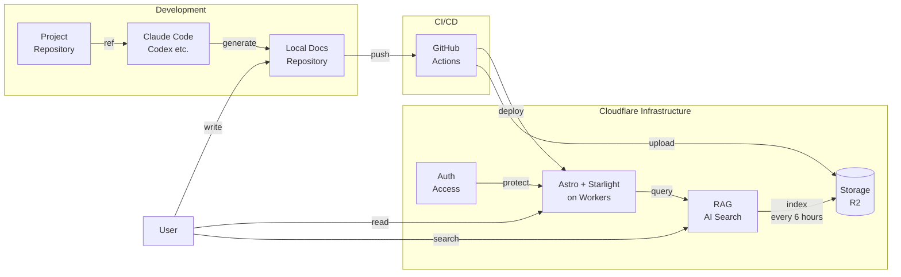

## Introduction

AI コーディングや Spec Drive Development の発展に伴い、作成した Design Doc などのドキュメントを LLM に読み込ませる機会が増えました。

ドキュメントは多くの職場で Notion や Confluence などのツールでドキュメントを作成するかと思います。これらのツールで書いたドキュメントは MCP を介して読み込ませる必要があります。MCP のレスポンスは余計な情報を含んでいることもあり、場合によってはコンテキストを余計に使ってしまうという課題があります。

Markdown でドキュメントを管理することで上述の問題は解決するものの、特に非エンジニアから見たときに human readable ではありません。
Markdown を何かしらの方法で整形して表示したドキュメント基盤をホスティングすることで人にとっても読んでもらいやくなると考えます。

そこで、Cloudflare をフル活用した LLM Friendry なドキュメント基盤を作ったので紹介します。

https://github.com/rikeda71/cloudflare-stack-docs

## Architecture

次のようなアーキテクチャになっています。

- Markdown で執筆
- Cloudflare Workers にホスティング
- 認可機能の搭載
- RAG を使った質問回答生成



### Framework

Astro + Starlight を採用します。

- [Astro](https://astro.build/) - 静的サイトジェネレーター
- [Starlight](https://starlight.astro.build/) - Astro ベースのドキュメントテーマ

Starlight は有名どころだと Cloudflare や Biome のドキュメントページで採用されています。

https://starlight.astro.build/ja/resources/showcase/

SSG フレームワークは好みのものを採用可能です。今回は下記の理由から Astro + Starlight を採用しました。

- 描画やビルドの速さ
- 後述する RAG へ質問できる画面の構築容易性
- [Pagefind](https://pagefind.app/) による全文検索が組み込まれている点
  - https://starlight.astro.build/ja/guides/site-search/

### Infrastructure

Cloudflare に基盤を載せることで、小 ~ 中規模であれば RAG も含めて安価に運用させる狙いがあります。

- [Cloudflare Workers](https://developers.cloudflare.com/workers/): ホスティング環境
- [Cloudflare R2](https://developers.cloudflare.com/r2/): ドキュメントのオブジェクトストレージ
- [Cloudflare AI Search](https://developers.cloudflare.com/ai-search/): RAG による質問に対する回答生成機能
- [Cloudflare Access](https://developers.cloudflare.com/cloudflare-one/access-controls/applications/http-apps/): 認証・認可（オプション）

Workers、R2 は無料枠が大きく、Access も 50 人までは無料です。そのため、利用コストとしては AI Search が間接的に利用する LLM や Cloudflare のサービスの利用料金が支配的になります。

:::message
R2 を利用するため、クレジットカードの登録は必要になります。
:::


## Usage

下記のように利用します。

- ユーザがローカルでドキュメントを執筆。PR を出してマージ。
- 自動で R2 上にアップロードされる。定期的に AI Search がドキュメントをクロールして RAG で検索可能になる。
- ユーザはホスティングされた基盤上でドキュメントを共有・閲覧する
- Claude Code などに読ませたいときはローカルのリポジトリを最新化して別の開発リポジトリからドキュメントを読ませる。

また、私は以下のように利用しています。

▼ ドキュメント基盤上に配置するドキュメント

- design doc
- adr
- 各種マニュアル

▼ 開発リポジトリ上に配置するドキュメント

- README 及び 開発用のコマンドや tips
  - {AGENTS|CLAUDE}.md を作るときに読解されるため。
- spec driven development 用の AI が中心に書いたドキュメント

## Tips

### RAG で質問する UI の実装について

Starlight は Markdown によるドキュメントを描画するのに特化したテーマとなっています。

このテーマを保ったまま非コンテンツページを描画するためには `<StarlightPage>` というコンポーネントで wrap する必要があります。

https://starlight.astro.build/guides/pages/#using-starlights-design-in-custom-pages

```tsx:search.astro
---
export const prerender = false;

import StarlightPage from "@astrojs/starlight/components/StarlightPage.astro";
import AISearch from "../components/AISearch.tsx";

const frontmatter = {
  title: "RAG Search",
};
---

<StarlightPage frontmatter={frontmatter}>
  <AISearch client:load />

</StarlightPage>
```

RAG に質問するための UI は検索結果の state を管理する必要があるため、React で実装しています。

また、Cloudflare AI Search に問い合わせる実装は astro の [APIRoute](https://docs.astro.build/ja/guides/endpoints/) を利用しています。
下記のように APIRoute のコンテキストが `locals` フィールドを持ちます。`locals.runtime` フィールドが Cloudflare Workers が実行時に注入するオブジェクトである `env` を持ちます。

```typescript
export const POST: APIRoute = async ({ request, locals }) => {
    ...

    // locals.runtime が env フィールドを持つ
    locals.runtime.env.AI.autorag(RAG_NAME).aiSearch({
        ...
    })
}
```

このフィールドから、Cloudflare Workers で Binding したリソースを呼び出すことができます。 Cloudflare AI Search の呼び出しは `AI` リソースから行うことができます。

下記コマンドで Astro 用の Cloudflare Workers プロジェクトをセットアップすることで、 `worker-configuration.d.ts` 及び `env.d.ts` に型情報が記載され、型推論を効かせることができます。

```bash
# ref. https://developers.cloudflare.com/workers/framework-guides/web-apps/astro/
$ pnpm create cloudflare@latest docs --framework=astro
...
# 以下のフォームが出てくる
# Use docs(Starlight) template を選択することで、Starlight も含めたプロジェクトを生成してくれる
# https://github.com/rikeda71/cloudflare-stack-docs をそのまま利用する場合、この手順は不要です
astro   Launch sequence initiated.

    ◼  dir Using xxx as project directory

 tmpl   How would you like to start your new project?
        ○ A basic, helpful starter project
        ○ Use blog template
        ● Use docs (Starlight) template
        ○ Use minimal (empty) template
```

RAG に質問する UI は下記のように動作します。


### textlint の設定

ドキュメント基盤の CI には文章校正ツールである [textlint](https://github.com/textlint/textlint) の設定を含めています。
AI が読む分には多少の typo や表現の揺れは吸収されますが、人も読む文章を書く前提なので、それらの是正のために導入しています。

Markdown にドキュメントを執筆するからこそ、このような仕組みも取り入れやすく、ドキュメントの品質も担保しやすくなります。

ルールとしてはひとまず日本語の技術文書向けプリセットを導入しています。

https://github.com/textlint-ja/textlint-rule-preset-ja-technical-writing

### Cloudflare AI Search のハマりポイント

RAG の運用に Cloudflare AI Search を利用していますが、下記のようなポイントに注意する必要があります。

ドキュメントの読み取りから検索 I/F まで簡単に提供してくれる RAG 基盤である一方、いくつか制約はあるため、この点を許容して利用する必要があります。

- [Document Size に Cloudflare AI Searh の制約あり](https://developers.cloudflare.com/ai-search/configuration/data-source/r2/)
    - > Plain text files: Up to 4 MB
- [ドキュメントのベクトル化・テキスト生成に使える LLM が限られている](https://developers.cloudflare.com/ai-search/configuration/models/supported-models/)
    - とはいえ、よく使われるモデルは利用できそう
    - Cloudflare だけで完結させるためには、Workers AI Provider のモデルを利用する必要がある (このページに掲載されていないが、 `qwen` のモデルもいくつか利用可能)
- [ベクトル化の自動更新は6時間であること](https://developers.cloudflare.com/ai-search/configuration/indexing/)
- markdown のドキュメントサイズが大きいとベクトル化の時に `workers ai timeout error` のようなタイムアウトエラーが発生する
- その他の制約
   - embedding に利用できるモデルの変更はできない。変更する場合、AI Search のインスタンスを構築し直す必要がある
   - RAG の精度改善で採用されるハイブリット検索やチャンキング最適化(固定長チャンキングのみ対応)に対応していない

また、AI Search は Beta 提供であるため、その点も許容して利用する必要があります。

## Summary

Markdown で執筆し、Cloudflare で安くホスティング・RAG を搭載することで LLM Friendry なドキュメント基盤を実現しました。

利用方法はリポジトリの README に記載していますので、よければ試していただけますと幸いです。
